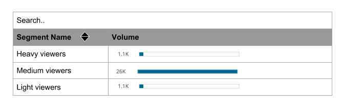

## Segment Viewer coding test

### Install

`npm install`

Run app: 

`npm start` 

### Intro

We are going to create a segment volume table as illustrated in the following sketch:

### Tasks

* Get data for the table from existing endpoints, and show it according to the mock above:
    * Handle /segments - The segment names should appear under the segment names column.
    * Handle /segments/volumes  - Fetch of volumes takes longer, pay attention to user experience.
        When data returned you have 2 option - volume or N/A
        
* CSS & UI bullets:
    * The table should be centered on the page
    * 1100 => 1.1K
    * Show blue bar - length according to scale
     
* Search and sorting is an extra bonus, start with a simple solution
